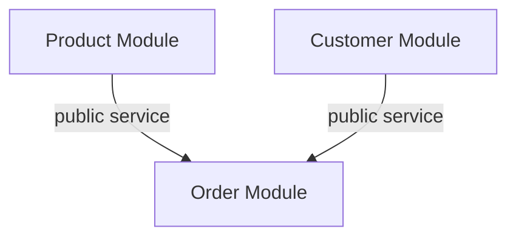

# TP2 - Diagramme des dependances modules

## Diagramme

## Regles de dependance

- Product Module: gere uniquement les produits, sans dependance vers Customer ou Order.
- Customer Module: gere uniquement les clients, sans dependance vers Product ou Order.
- Order Module: depend uniquement de `ProductService` et `CustomerService` (services publics), jamais des repositories externes.

## Verification dans le code

- Service public Product utilise par Order:
  - `com.ecommerce.monolith.product.service.ProductService`
- Service public Customer utilise par Order:
  - `com.ecommerce.monolith.customer.service.CustomerService`
- Service Order:
  - `com.ecommerce.monolith.order.service.OrderServiceImpl`

## Exigences de l'exercice implementees

1. Modules Customer et Order implantes avec Entities, Services, Repositories, DTOs, Mapper.
2. Methode de verification d'existence Customer:
   - `CustomerService.existsCustomer(Long id)`
   - endpoint `GET /api/customers/{id}/exists`
3. Endpoint historique commandes client:
   - `GET /api/orders/history/{customerId}`
